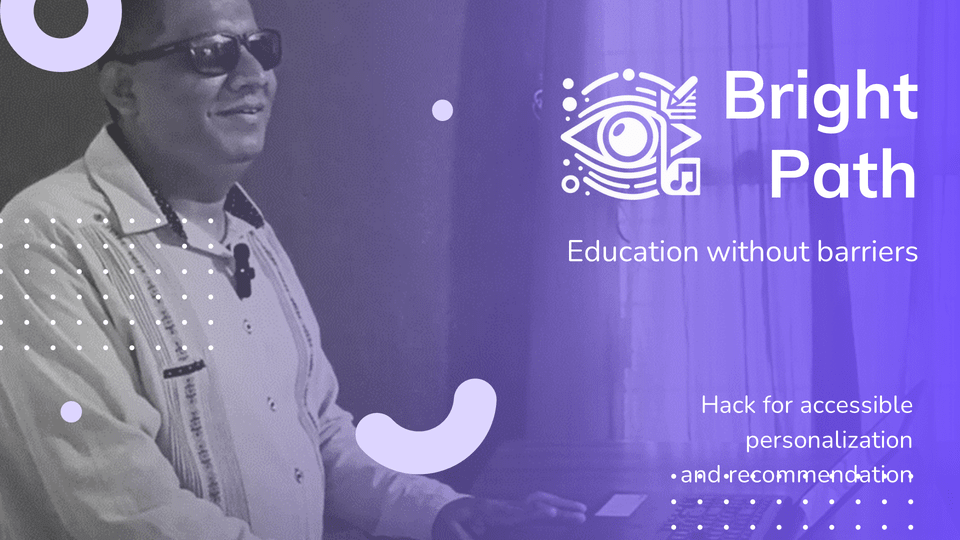

## BrightPath

Interactive reading assistant that allows the user to manage states while listening to a reading. It provides the ability to pause (Spacebar), resume (Control), and finish (Enter). At the pause moment, listen carefully to the voice guidance of the assistant to prompt you to save your own note or ask questions about the text that has already been read, so that you can save what is most important to you. Upon audio completion, the assistant will generate a list of notes, analyze them, and suggest additional videos as educational material to complement your studies.

### Welcome to our solution!
Our solution consists of 2 directories.
To know about how to execute each one, enter to the README inside each directory for detailed instructions.

* flujo-python: Complete logic to use the assistant from the terminal.
* client-server: Complete logic to use the assistant through a web client communicating with a server.

### Motivations

Our development began with a need to improve the life of a person with visual impairment. Part of the journey was to discover which specific experience was relevant to this person and to creatively plan how to approach it. As a result, the initiative uses inclusive technologies through a voice-guided assistant that allows the use of various inputs: via keyboard, voice commands, and so on.

Finally, to achieve this, we make use of the following Azure technologies:
* **Speech Synthesizer & Recognizer**: Listening to the user and responding to them.
* **Text analytics (Keywords) & Text Translation**: Extracting keywords from the saved notes and multilingual support.
* **Conversational Language Understanding**: Extracting the user's intent according to what they indicate by voice to save notes.
* **Azure OpenAI**: Analyzing user questions to infer from the text read.
* **Bing search (Video)**: Extracting additional videos according to the keywords.

Our commitment is steadfast: to improve the quality of life for many people, promoting a future where accessibility and inclusion are the norm.